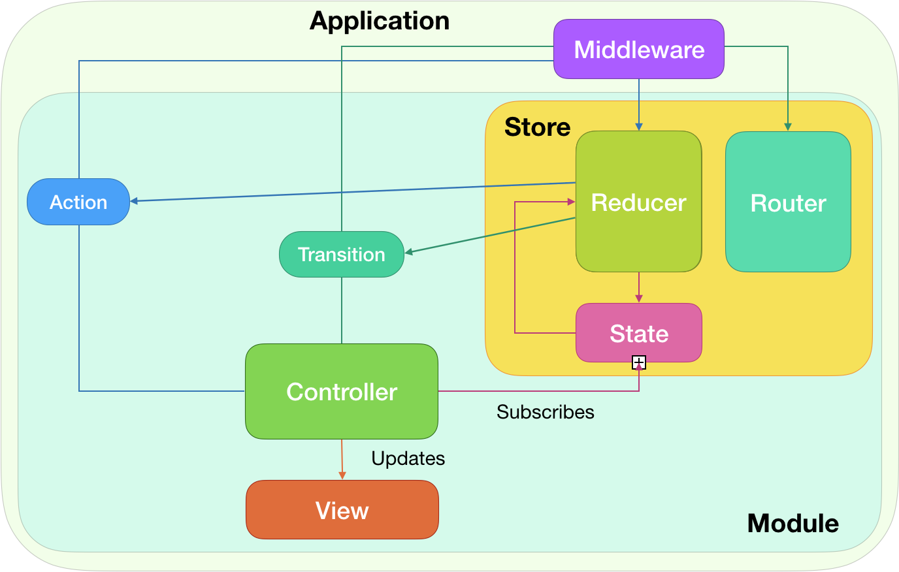

# Amber


[](http://cocoapods.org/pods/Amber)
[](http://cocoapods.org/pods/Amber)
[](http://cocoapods.org/pods/Amber)

## Overview

Amber is flexible architecture based on Elm & Flux ideas and developed specifically for iOS. It separetes components of a module into six parts: 


**State**: is plain struct responsible for holding all data based on which interface is drawn.

**Actions**: are events that can happen in module: button press, data loaded, etc. 

**Reducer**: is class responsible for processing Actions and for initial setup.

**Transitions**: are types of transitions that can happen in module.

**Router**: is class responsible for processing Transitions

**Store**: holds reference to Reducer, Router and current State.

**Controller**: is plain mapping of the state into the user interface. It subscribes to current state and updates view accordingly to the new state. It also responsible for sending Actions and Transitions to the Store. 

## Benefits

– makes application behavior more predictable;

– code stays good structured as your application grows;

– allow you to intercept all application events;

– easier to refactor and modify your code.

## Schema


## In depth overview

### State

State is a struct that stores all data needed for your module. For example:

```
struct FeedState: AmberState {
    var description: String {
        return "isLoading: \(isLoading), items: \(feedItems.count)"
    }
    
    var isLoading = true
    var feedItems: [FeedItem] = []

    init(data: Void) { }
}
```
State should not store any UI components but it should store all the data needed to unambiguously display the view i.e. for the same state your view should always looks the same. 

### Actions

Action is enum that lists all actions that can happen inside a module. For example:

```
enum FeedAction: AmberAction{
    case itemsLoaded([FeedItem])
    case like(Int)
}
```
action cases should contain any data needed to process them.

### Reducer

Reducer is a class that is mainly responsible for processing Actions. It takes as input a current state and an action which is occurred and should return new state.

```
class FeedReducer: AmberReducer{
    /* other code */
    
    func reduce(action: FeedAction, state: FeedState,
                performTransition: @escaping (FeedTransition) -> Void,
                performAction: @escaping (FeedAction) -> Void,
                performOutputAction: @escaping (FeedOutputAction) -> Void) -> FeedState{
        var newState = state
        switch action {
        case .itemsLoaded(let items):
            newState.isLoading = false
            newState.feedItems = items
        case .like(let index):
            let item = newState.feedItems[index]
            item.isLiked = !item.isLiked
        }
        return newState
    }
    
    /* other code */
}
```
Reduce function should be [pure function](https://en.wikipedia.org/wiki/Pure_function). Reducer is not required to change state for every action, for any of them it can perform transitions:

```
        case .showUser(let user):
            if user.isCurrent { performTransition(.profile) }
            else { performTransition(.information(user)) } 
```
or perform other actions:
```
        case .reloadItems:
            itemsLoader.load(completion: { items in performAction(.itemsLoaded(items)) })
```

### Transition

Transition is enum that lists all transition that can happen in current module. For example:

```
enum FeedTransition: AmberTransition{
    case profile
    case showPhoto(UIImage)
}
```
Transitions like actions should contain any data needed to process them

### Router

Router is class that performs transitions and processes output actions from presented/embedded modules. For example:
```
class FeedRouter: AmberRouter{
    func perform(transition: FeedTransition,
                 route: AmberRoutePerformer,
                 reducer: FeedReducer,
                 performAction: @escaping (FeedAction) -> Void){
        switch transition {
        case .profile: _ = route.show(ProfileModule)
        case .showPhoto(let image): _ = route.show(FeedItemModule, data: image)
        }
    }
}
```

### Store

Store is responsible for recieving actions and transitions, storing current state, router and reducer. Store is the only component that you should not override yourself – it is provided and implemented by Amber itself. You initialize store with Reducer and Router objects in your Controller as follows:

```
final class FeedController: UIViewController, AmberController {

    let store = AmberStore(reducer: FeedReducer(), router: FeedRouter())
```


### Controller

Controller is the UIViewController subclass. It is responsible for binding state to UI and mapping user actions Actions/Transitions cases and sending them to store. For example:

```
//MARK: - Bindings
extension FeedController{
    func bind(){
        profileButton.reactive.tap
            .replace(with: .profile)
            .bind(to: transition)
        
        state.map { $0.isLoading }.bind(to: activityIndicator.reactive.isAnimating)
    }
}
```

There are two ways Controller can send Action events to Store:
1) bind any event (like button tap) to Store property `action` in a reactive way:
```
plusButton.reactive.tap
    .replace(with: .increaseAmount)
    .bind(to: action)
```
2) dispatch `Action` manually:
```
extension FeedController: UITableViewDelegate{
    func tableView(_ tableView: UITableView, didSelectRowAt indexPath: IndexPath){
        store.perform(action: .like(indexPath.row))
    }
}    
```        
The same is true about transitions:
```
extension FeedController{
    func bind(){
        profileButton.reactive.tap
            .replace(with: .profile)
            .bind(to: transition)
    }
}

extension FeedController: UITableViewDelegate{
    func tableView(_ tableView: UITableView, didSelectRowAt indexPath: IndexPath){
        if let image = store.currentState().feedItems[indexPath.row].image{
            store.perform(transition: .showPhoto(image))
        }
    }
}
```

Controller should not store in self no other properties than UIView objects. All other properties should be places in State.
Most preferred way to work with state is to bind or subscribe to it. If you need to access it current value you can call `store.currentState()`.

### Middleware

Middleware is one of the coolest Amber's feature. It can react to any Event (Action and Transition) before or after it happens. More important Middleware can intersect events and delay or even cancel them until some conditions are met. Example will follow bul lets start with a simple example – logging all events. All middleware implementations should conform to AmberMiddleware protocol:

```
public protocol AmberMiddleware{
    //Implement this function to process any event before it happens
    func process(state: Any, beforeEvent event: Any)
    
    //Implement this function to be able to delay or cancel any event before it will be directed to reducer
    func perform(event: Any, onState state: Any, route: AmberRoutePerformer, performBlock: @escaping () -> ())
    
    //Implement this function to process event or state after event was dispatched.
    func process(state: Any, afterEvent event: Any, route: AmberRoutePerformer)
}
```
All this three functions have default implementations so in your Middleware you can implement only necessary ones. Logging Middleware will look as follows:
```
class LoggingMiddleware: AmberMiddleware{
    func process(state: Any, afterEvent event: Any, route: AmberRoutePerformer){
        print("----------------------------------------")
        print("\(type(of: event)).\(event) -> \(state)")
    }
}
```
You register it as follows:
```
@UIApplicationMain
class AppDelegate: UIResponder, UIApplicationDelegate {

    var window: UIWindow?

    func application(_ application: UIApplication, didFinishLaunchingWithOptions launchOptions: [UIApplicationLaunchOptionsKey: Any]?) -> Bool {
        Amber.main.registerSharedMiddleware(LoggingMiddleware())
        /* other code... */
```
After that all app events will be printed in the console:
```
----------------------------------------
FeedAction.itemsLoaded([Paris, Flying man, Old Car]) -> isLoading: false, items: 3
----------------------------------------
FeedTransition.profile -> isLoading: false, items: 3
```
Lets consider more complicated case: our app has some actions that needs user confirmation before they can be performed. We could solve it in a such way:

```
protocol ConfirmationRequirable{
    var needsConfirmation: Bool { get }
}

class ConfirmationMiddleware: AmberMiddleware{
    func perform(event: Any, route: AmberRoutePerformer, performBlock: @escaping () -> ()){
        //only if event that should occure is ConfirmationRequirable AND its needsConfirmation is true we proceed
        guard let crEvent = event as? ConfirmationRequirable, crEvent.needsConfirmation else{
            //otherwise we say that this action should be performed without any side affects
            //calling performBlock() invokes next Middleware to process this action or if it is the last registered Middleware, delivers this event to designated reducer/router
            performBlock()
            return
        }
        
        //we presents ConfirmationModule (popup)
        _ = route.present(ConfirmationModule) { a in
            //only if (and when) user confirmed this event we forwarding it
            if a == .confirmed { performBlock() }
        }
    }
}
```

After registering it `Amber.main.registerSharedMiddleware(LoggingMiddleware(), ConfirmationMiddleware())` and conforming any Event to `ConfirmationRequirable`:
```
enum CartAction: AmberAction, ConfirmationRequirable{
    case clearCart, reload

    var needsConfirmation: Bool { return self == .clearCart }
}
```

From now on after Cart's store will recieve `.clearCart` action, `ConfirmationMiddleware` will take over and present a popup. If user would press "Confirm" then the action will be delivered to CartReducer otherwise it won't be dispatched. You can even implement `ConfirmationRequirable` protocol in transitions:
```
enum ProfileTransition: AmberAction, ConfirmationRequirable{
    case history, logout

    var needsConfirmation: Bool { return self == .logout }
}
```

Using middlewares helps you to write less code and reuse such logic between all modules. Other common cases of middlewares are: AnalyticsMiddleware (send events to your favorite analytics), NotificationMiddleware (notifies user that some event was performed), ServerMiddleware (performs server request), ErrorProcessing, Authorization (presents authorization screen for unauthorized users) and so on.

## Amber module for generamba
Here is [amber module](https://github.com/Anvics/AmberModule) for 
[Generamba](https://github.com/rambler-digital-solutions/Generamba)

## Example
You can check out simple example of Amber usage: [TestProject](https://github.com/Anvics/AmberExample)

## Installation

Amber is available through [CocoaPods](http://cocoapods.org). To install
it, simply add the following line to your Podfile:

```ruby
pod 'Amber'
```

## Author

Nikita Arkhipov, nikitarkhipov@gmail.com
Anvics

## License

Amber is available under the MIT license. See the LICENSE file for more info.
